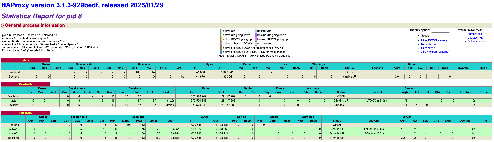

# 2025-09-22 Репликация

## Задачи и методики

Цель:
- настроить разные виды репликации
- проверить влияние репликации на производительность
- убедиться, что в случае кворумной репликации данные не теряются при аварии

Описание системы:
- Таблица users с полями
  - first_name: character varying(256) not null
  - second_name: character varying(256) not null
- Данные пользователей
  - таблица пользователей содержит 1.000.000 записей
  - для генерации записей реализован [генератор данных](https://github.com/Grin941/social-network/blob/main/src/data_generator/generator.py)
  - ФИО в локале RU генерирует библиотека [Faker](https://pypi.org/project/Faker/)

Методика тестирования:
- каждый тест проводится в 4 этапа
  - user: 1 / spawn_rate: 1 / duration: 60
  - user: 10 / spawn_rate: 1 / duration: 60
  - user: 100 / spawn_rate: 10 / duration: 90
  - user: 1000 / spawn_rate: 50 / duration: 90
- отношение Read:Write 2:1
- тестированию подвергаем операции
  - получения пользователя по id
    - API: ```GET /user/get/{id}```
    - SQL Query: ```SELECT * FROM users WHERE id = {id}```
  - поиска
    - API: ```GET /user/search?first_name=NAME&last_name=SURNAME```
    - SQL Query: ```SELECT * FROM users WHERE second_name LIKE 'second_name%' AND first_name LIKE 'first_name%' ORDER BY id```
  - регистрации пользователя
    - API: ```POST /user/register```
    - SQL Query: ```INSERT INTO users (id, first_name, second_name, birthdate, biography, city, password) VALUES (:id, :first_name, :second_name, :birthdate, :biography, :city, :password)```
  - получение токена
    - API: ```POST /login```
    - SQL Query: ```SELECT * FROM users WHERE id = {id}```
- критерии приемки
  - репликация работает
- мониторинг
  - всего запросов
  - ошибки
  - RPS (avg)
  - latency (99 percentile)
  - replication lag (max)
- Тестовый стенд
  - асинхронный сервер [Gunicorn](https://gunicorn.org/), 1 worker
  - тестирование проводится на локальном компьютере
    - Apple M2
    - 8 CPU
    - 16 RAM
    - HDD 1000Gb
  - между приложением и кластером БД стоит [HaProxy](https://www.haproxy.org/)

План тестирования:
- тестирование без репликации
- тестирование с потоковой репликацией: 2 слейва, 1 мастер
- тестирование с кворумной синхронной репликацией
- тестирование после отключения мастера и промоута одного слейва до мастера

## Проведение тестирования

### Тестирование без репликации

Собираем данные о работе системы под нагрузкой

#### Запуск теста

Запускаем приложение
```shell
set -a && source .env && set +a && docker compose -f devops/tests_load_replication/docker-compose.replication-disabled.yaml up --build
```

Запускаем тест
```shell
set -a && source .env && set +a && locust -f tests/load/replication/locustfiles/base.py --timescale --headless
```

#### Информация о нагрузке


HaProxy показывают одну ноду в RW режиме


Всего сервер обработал 5721 запросов.

Число ошибок 614, что равно 11% от общего числа запросов


Cредний RPS = 24.

Начал падать после 500 пользователей. До 100 пропускная способность была ровной.

Но после 500 пользователей, когда сервер перестал держать коннекты, пропускная способность упала в ноль.


На графике с 99 персентилем видно, что рост latency достаточно плавный (log)

При этом больше всего проседанию подвержен метод GET /search

| Configuration   | RPS (50) | latency (99) | total queries | errors % | replication lag |
|-----------------|----------|--------------|---------------|----------|-----------------|
| Single Instance | 24       | 11           | 5721          | 11       | -               |

### Тестирование с двумя асинхронными потоковыми репликами

#### Запуск теста

Запускаем приложение
```shell
set -a && source .env && set +a && docker compose -f devops/social_network/docker-compose.replication-physical.yaml up --build
```

Запускаем тест
```shell
set -a && source .env && set +a && locust -f tests/load/replication/locustfiles/base.py --timescale --headless
```



HaProxy показывают одну ноду в Write режиме и две в Read


Всего сервер обработал 2553 запроса – cервер справился с меньшей нагрузкой (-56%), чем без репликации.

Число ошибок 100, что равно 4% от общего числа запросов


Cредний RPS = 11.

Начал падать после 500 пользователей.

Но после 500 пользователей, когда сервер перестал держать коннекты, пропускная способность упала в ноль.


Replication Lag на обеих репликах распределен равномерно и достигает 300 - 400 ms


Latency = 11, что не отличается от прежнего показателя

| Configuration             | RPS (50)  | latency (99) | total queries | errors % | replication lag |
|---------------------------|-----------|--------------|---------------|----------|-----------------|
| Async 1 Master - 2 Slaves | 11 (-55%) | 11 (+0%)     | 2553 (-56%)   | 4 (-74%) | 300 - 400 ms    |


### Тестирование кворумной репликации с одним мастером и двумя слэйвами

Кворум реализуем с помощью [Patroni](https://github.com/patroni/patroni)

#### Запуск теста

Запускаем приложение
```shell
set -a && source .env && set +a && docker compose -f devops/tests_load_replication/docker-compose.replication-quorum.yaml  up --build
```

Если сервисы patroni отдают ошибку FATAL: data directory "/var/lib/postgresql/patroni/main" has invalid permissions, то нужно
```shell
;1. Поменять права volumes
chmod 0750 ./devops/tests_load_replication/patroni-data*

;2. Перезагрузить сервисы
set -a && source .env && set +a && docker compose -f devops/tests_load_replication/docker-compose.replication-quorum.yaml  down --volumes
set -a && source .env && set +a && docker compose -f devops/tests_load_replication/docker-compose.replication-quorum.yaml  up --build
```

Запускаем тест
```shell
set -a && source .env && set +a && locust -f tests/load/replication/locustfiles/base.py --timescale --headless
```


HaProxy показывает, что из трех нод одна работает в режиме мастера, а две – в режиме слэйва


Всего сервер обработал 7264 запроса – cервер справился с большей нагрузкой (+27%), чем без репликации.

Число ошибок 82, что равно 1% от общего числа запросов


Cредний RPS = 26.

Начал падать уже после 1000 пользователей.


Replication Lag на обеих репликах распределен равномерно и достигает 150 - 200 ms


Latency = 11, что не отличается от прежнего показателя

| Configuration              | RPS (50)   | latency (99) | total queries | errors % | replication lag     |
|----------------------------|------------|--------------|---------------|----------|---------------------|
| Quorum 1 Master - 2 Slaves | 26 (+136%) | 11 (+0%)     | 7264 (+27%)   | 1 (-90%)  | 150 - 200 ms (-50%) |

### Тестирование кворумной репликации со слейвом, промоцченным в мастер

- отключим master
- убедимся, что patroni запромоутил реплику в мастер
- проведем замеры производительности
- вернем мастер в качестве слэйва
- убедимся, что изменения доехали до старого мастера

#### Запуск теста

Запускаем приложение
```shell
set -a && source .env && set +a && docker compose -f devops/tests_load_replication/docker-compose.replication-quorum.yaml  up --build
```

Запускаем тест
```shell
set -a && source .env && set +a && locust -f tests/load/replication/locustfiles/base.py --timescale --headless
```

Отключаем контейнер с мастером

Снова запускаем тест, чтобы дать нагрузку на две оставшиеся ноды


HaProxy показывает, что старый слэйв стал мастером, а старый мастер недоступен


Всего сервер обработал 3932 запроса – cервер справился с cервер справился с меньшей нагрузкой (-31%), чем без репликации.

Число ошибок 464, что равно 11% от общего числа запросов


Cредний RPS = 16.

Начал падать уже после 100 пользователей.


Replication Lag стал нулевым


Latency = 11, что не отличается от прежнего показателя

| Configuration              | RPS (50)  | latency (99) | total queries | errors % | replication lag |
|----------------------------|-----------|--------------|---------------|----------|-----------------|
| Promote 1 Master - 1 Slave | 16 (-33%) | 11 (+0%)     | 3932 (-32%)   | 11 (+0%) | 0 ms (-100%)    |

Вернем старый мастер и выполним на старом мастере и старой реплике запрос

```sql
SELECT COUNT(*) FROM users;
```


В обоих случаях ответ одинаковый

## Выводы

| Configuration              | RPS (50)    | latency (99) | total queries | errors %   | replication lag     |
|----------------------------|-------------|--------------|---------------|------------|---------------------|
| Single Instance            | 24          | 11           | 5721          | 11         | -                   |
| Async 1 Master - 2 Slaves  | 11 (-55%)   | 11 (+0%)     | 2553 (-56%)   | 4 (-74%)   | 300 - 400 ms        |
| Quorum 1 Master - 2 Slaves | 26 (+136%)  | 11 (+0%)     | 7264 (+27%)   | 1 (-90%)   | 150 - 200 ms (-50%) |
| Promote 1 Master - 1 Slave | 16 (-33%)   | 11 (+0%)     | 3932 (-32%)   | 11 (+0%)   | 0 ms (-100%)        |

- самой производительной оказалась конфигурация Quorum 1 Master - 2 Slaves
- при промоуте реплики на конфигурации 1-1 производительность сильно упала
- при возврате реплики (но уже в состоянии слэйв) изменения до нее доехали
