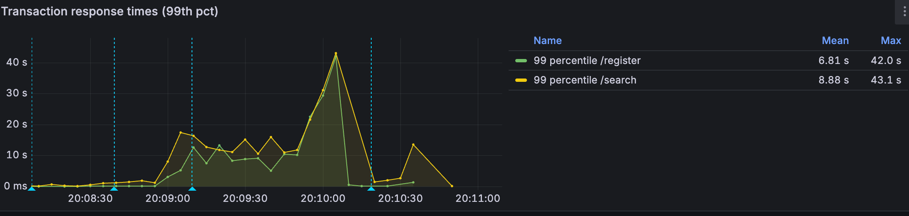
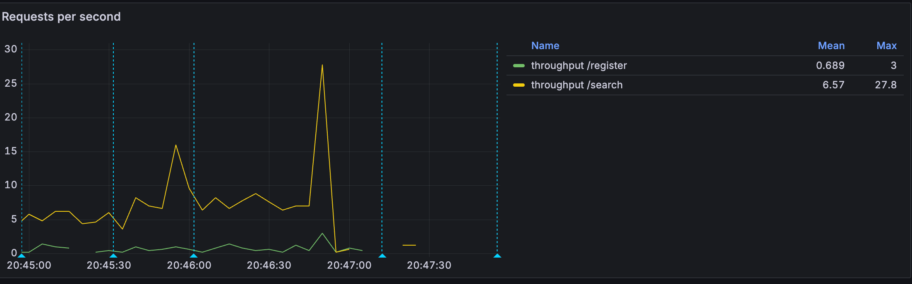

# 2025-07-30 Производительность индексов

## Задачи и методики

Цель:
- выбрать оптимальный индекс для поиска анкет пользователей
- проверить влияние индекса на поиск
- проверить влияние индекса на вставку

Описание системы:
- Таблица users с полями
  - first_name: character varying(256) not null
  - second_name: character varying(256) not null
- Данные пользователей
  - таблица пользователей содержит 1.000.000 записей
  - для генерации записей реализован [генератор данных](https://github.com/Grin941/social-network/blob/main/src/data_generator/generator.py)
  - ФИО в локале RU генерирует библиотека [Faker](https://pypi.org/project/Faker/)

Методика тестирования:
- каждый тест проводится в 4 этапа
  - user: 1 / spawn_rate: 1 / duration: 30
  - user: 10 / spawn_rate: 1 / duration: 30
  - user: 100 / spawn_rate: 10 / duration: 60
  - user: 1000 / spawn_rate: 50 / duration: 60
- отношение поиска к вставке 10:1 (гипотеза, что на таком отношении моно увидеть влияние индекса на вставку, но не внести существенной погрешности в размер БД)
- тестированию подвергаем операции
  - поиска
    - API: ```GET /user/search?first_name=NAME&last_name=SURNAME```
    - SQL Query: ```SELECT * FROM users WHERE second_name LIKE 'second_name%' AND first_name LIKE 'first_name%' ORDER BY id```
  - регистрации пользователя
    - API: ```POST /user/register```
    - SQL Query: ```INSERT INTO users (id, first_name, second_name, birthdate, biography, city, password) VALUES (:id, :first_name, :second_name, :birthdate, :biography, :city, :password)```
- критерии приемки
  - планировщик запросов применяет индекс на поиск
  - throughput поиска выше
  - latency поиска ниже
  - производительность вставки падает не существенно
- мониторинг
  - всего запросов
    - /register
    - /search
  - ошибки
    - /register
    - /search
  - throughput
    - /register
    - /search
  - latency (avg)
    - /register
    - /search
  - latency (99 percentile)
    - /register
    - /search
- Тестовый стенд
  - асинхронный сервер [Gunicorn](https://gunicorn.org/), 1 worker
  - тестирование проводится на локальном компьютере
    - Apple M2
    - 8 CPU
    - 16 RAM
    - HDD 1000Gb

План тестирования:
- тестирование без индексов
- тестирование с двумя отдельными b-tree индексами
- тестирование с составным b-tree индексом
- тестирование с двумя отдельными GIN-индексами
- тестирование с составным GIN-индексом
- тестирование с двумя отдельными GIST-индексами

## Проведение тестирования

### Подготовка к тестированию

Запускаем приложение
```shell
set -a && source .env && set +a && docker compose -f devops/tests_load_search_users_by_name_idx/docker-compose.yaml up --build
```

### Тестирование без индексов

Собираем данные о работе системы под нагрузкой

#### Запуск теста

```shell
set -a && source .env && set +a && locust -f tests/load/search_users_by_name_idx/locustfiles/no_index.py --timescale --headless
```

#### Информация о нагрузке


Всего сервер обработал 1779 запросов.

Число ошибок 297, что равно 17% от общего числа запросов

Сервер перестал справляться с нагрузкой и начал отдавать TimeoutError к бд, начиная от 500 пользователей.

#### Анализ Latency / Throughput


До 500 пользователей пропускная способность была довольно ровной.

Но после 500 пользователей, когда сервер перестал держать коннекты, пропускная способность упала в ноль.


Средний latency плавно растет до 500 пользователей.

После 500 пользователей падает, потому что сервер начинает отдавать Response 500.


На графике с 99 персентилем видно, что рост latency не такой плавный
- плавный рост до 100 пользователей
- константа от 100 до 500
- улетает вверх от 500
- падает в 0, когда сервер начинает отдавать ошибки

| API request | throughput (mean) | throughput (max) | latency avg (mean) | latency avg (max) | latency 99 (mean) | latency 99 (max) |
|-------------|-------------------|------------------|--------------------|-------------------|-------------------|------------------|
| /register   | 1                 | 3.6              | 6.3                | 35.6              | 8.9               | 39.3             |
| /search     | 10.8              | 52               | 5.9                | 36.4              | 10.6              | 39.4             |

#### Анализ плана запроса


- cost=50619...50619
- Seq Scan

### Тестирование с двумя b-tree индексами

На лекции рассказывали, что b-tree не будет работать на LIKE – проверим на живых данных

#### Запуск теста

Запрос на создание индекса
```sql
CREATE EXTENSION IF NOT EXISTS pageinspect;
CREATE INDEX IF NOT EXISTS second_name_idx on users(second_name);
CREATE INDEX IF NOT EXISTS first_name_idx on users(first_name);
```

Команда на запуск теста
```shell
set -a && source .env && set +a && locust -f tests/load/search_users_by_name_idx/locustfiles/btree_separate.py --timescale --headless
```

#### Информация о нагрузке


Всего сервер обработал 1950 запросов – cервер справился с большей нагрузкой (+10%), чем без индекса и также отдавал TimeoutError на загрузке в 500 пользователей.

Ошибки были не в 17%, а в 8% запросов.

#### Анализ Latency / Throughput


Пропускная способность выросла по сравнению с вариантом без индекса в среднем на 38%


Средний latency сократился в среднем на 23%.



99 персентиль latency почти не изменился

| API request | throughput (mean) | throughput (max) | latency avg (mean) | latency avg (max) | latency 99 (mean) | latency 99 (max) |
|-------------|-------------------|------------------|--------------------|-------------------|-------------------|------------------|
| /register   | 1.43 (+43%)       | 5 (+39%)         | 4 (-41%)           | 30 (-16%)         | 6.8 (-24%)        | 42 (+7%)         |
| /search     | 14.3 (+32%)       | 60 (+39%)        | 4.4 (-25%)         | 33 (-9%)          | 8.9 (-16%)        | 43.1 (+9%)       |

#### Анализ плана запроса и размера индекса

```sql
EXPLAIN ANALYZE
SELECT *
FROM users
WHERE first_name LIKE 'Гал%' AND second_name LIKE 'Фок%' ORDER BY id;
```


- cost=50607...50614
- Seq Scan

Смотрим размер индекса
```sql
SELECT pg_size_pretty(pg_indexes_size('users'));
```

План запроса не поменялся:
- косты примерно такие же
- тот же seй scan
- размер индекса 125 MB

#### Выводы

- планировщик выполняет Seq Scan
- косты не поменялись 50607...50614
- throughput +38%
- latency -30%
- total requests +10%
- errors requests -50%
- ошибки стали возникать на 500 одновременно работающих пользователях
- размер индекса 125 MB

### Тестирование с составным b-tree индексом

Проверим, как изменятся показатели при составном b-tree индексе

#### Запуск теста

Запрос на создание индекса
```sql
CREATE EXTENSION IF NOT EXISTS pg_trgm;
CREATE EXTENSION IF NOT EXISTS pageinspect;
CREATE EXTENSION IF NOT EXISTS btree_gin;
CREATE INDEX IF NOT EXISTS name_gin_idx ON users USING GIN (second_name, first_name gin_trgm_ops);
```
Первой в tuple идет фамилия, потому что полагаем, что по одной фамилии ищут чаще, чем по одному имени

Команда на запуск теста
```shell
set -a && source .env && set +a && locust -f tests/load/search_users_by_name_idx/locustfiles/btree_compound.py --timescale --headless
```

#### Информация о нагрузке


Всего сервер обработал 1045 запросов – cервер справился с меньшей нагрузкой (-41%), чем без индекса и начал отдавать TimeoutError только на нагрузке в 300 пользователей.

А вот ошибки были также в 10% запросов.

#### Анализ Latency / Throughput



Пропускная способность снизилась по сравнению с вариантом без индекса в среднем на 33%


Средний latency почти не изменился (-3%).


99 персентиль latency увеличился в среднем на 23%

| API request | throughput (mean) | throughput (max) | latency avg (mean) | latency avg (max) | latency 99 (mean) | latency 99 (max) |
|-------------|-------------------|------------------|--------------------|-------------------|-------------------|------------------|
| /register   | 0.7 (-30%)        | 3 (-17%)         | 6.2 (-2%)          | 25.5 (-28%)       | 9 (+1%)           | 51.9 (+32%)      |
| /search     | 6.6 (-39%)        | 27.8 (-47%)      | 7.2 (+22%)         | 35.8 (-2%)        | 13.5 (+28%)       | 51.8 (+31%)      |

#### Анализ плана запроса и размера индекса

```sql
EXPLAIN ANALYZE
SELECT *
FROM users
WHERE first_name LIKE 'Гал%' AND second_name LIKE 'Фок%' ORDER BY id;
```


- cost=37873...37873
- Seq Scan

Смотрим размер индекса
```sql
SELECT pg_size_pretty(pg_indexes_size('users'));
```

План запроса не поменялся:
- косты немного снизились
- тот же seq scan
- размер индекса 89 MB

#### Выводы

- планировщик выполняет Seq Scan
- косты немного снизились 37873...37873
- throughput -33%
- latency -3%
- total requests -41%
- errors requests 0%
- ошибки стали возникать на 350 одновременно работающих пользователях
- размер индекса 89 MB

### Тестирование с двумя GIN-индексами

Навесим GIN-индекс на каждое поле

#### Запуск теста

Запрос на создание индекса
```sql
CREATE EXTENSION IF NOT EXISTS pageinspect;
CREATE EXTENSION IF NOT EXISTS btree_gin;
CREATE INDEX IF NOT EXISTS first_name_gin_idx ON users USING GIN (first_name gin_trgm_ops);
CREATE INDEX IF NOT EXISTS second_name_gin_idx ON users USING GIN (second_name gin_trgm_ops);
```

Команда на запуск теста
```shell
set -a && source .env && set +a && locust -f tests/load/search_users_by_name_idx/locustfiles/gin_separate.py --timescale --headless
```

#### Информация о нагрузке


Всего сервер обработал 42995 запросов – cервер справился с большей нагрузкой (+2316%).

За время теста случилась только одна ошибка (0%).

#### Анализ Latency / Throughput


Пропускная способность выросла по сравнению с вариантом без индекса в среднем на 1425%


Средний latency уменьшился в среднем на 81%.

Gри этом расти он начинает, когда число пользоателей приближается к 1000.


99 персентиль latency уменьшился в среднем на 61%

| API request | throughput (mean) | throughput (max) | latency avg (mean) | latency avg (max) | latency 99 (mean) | latency 99 (max) |
|-------------|-------------------|------------------|--------------------|-------------------|-------------------|------------------|
| /register   | 21.6 (+2060%)     | 42.4 (+1077%)    | 0.7 (-89%)         | 4.9 (-86%)        | 3.2 (-64%)        | 14.2 (-63%)      |
| /search     | 211 (+1853%)      | 420 (+708%)      | 1.6 (-73%)         | 9.4 (-74%)        | 4.1 (-61%)        | 18.2 (-54%)      |

#### Анализ плана запроса и размера индекса

```sql
EXPLAIN ANALYZE
SELECT *
FROM users
WHERE first_name LIKE 'Гал%' AND second_name LIKE 'Фок%' ORDER BY id;
```


- cost=477...477
- Bitmap Index Scan

Смотрим размер индекса
```sql
SELECT pg_size_pretty(pg_indexes_size('users'));
```

План запроса поменялся:
- косты cнизились на порядок
- Bitmap Index Scan
- размер индекса 146 MB

#### Выводы

- планировщик выполняет Bitmap Index Scan
- косты снизились на порядок 477...477
- throughput +1425%
- latency -70%
- total requests +2316%
- errors requests -100%
- за все время тестов возникла только одна ошибка
- размер индекса 146 MB

### Тестирование составного GIN-индекса

Навесим составной GIN-индекс

#### Запуск теста

```sql
CREATE EXTENSION IF NOT EXISTS pg_trgm;
CREATE EXTENSION IF NOT EXISTS pageinspect;
CREATE EXTENSION IF NOT EXISTS btree_gin;
CREATE INDEX IF NOT EXISTS name_gin_idx ON users USING GIN (second_name, first_name gin_trgm_ops);
```
Первой в tuple идет фамилия, потому что полагаем, что по одной фамилии ищут чаще, чем по одному имени

Команда на запуск теста
```shell
set -a && source .env && set +a && locust -f tests/load/search_users_by_name_idx/locustfiles/gin_compound.py --timescale --headless
```

#### Информация о нагрузке


Всего сервер обработал 33236 запросов – cервер справился с большей нагрузкой (+1768%).

За время теста не случилось ни одной ошибки (0%).

#### Анализ Latency / Throughput


Пропускная способность выросла по сравнению с вариантом без индекса в среднем на 1027%

При этом она растет до 700 пользователей, а потом начинает падать


Средний latency уменьшился в среднем на 79%.


99 персентиль latency уменьшился в среднем на 54%

При этом на 1000 пользователей следует отметить пик на загрузку пользователей, которого нет при других индексах

| API request | throughput (mean) | throughput (max)  | latency avg (mean) | latency avg (max) | latency 99 (mean) | latency 99 (max) |
|-------------|-------------------|-------------------|--------------------|-------------------|-------------------|------------------|
| /register   | 16.7 (+1570%)     | 29.8 (+727%)      | 1.2 (-80%)         | 6.1 (-83%)        | 3.8 (-57%)        | 22.8 (-42%)      |
| /search     | 163 (+1409%)      | 262 (+403%)       | 1.7 (-71%)         | 7 (-81%)          | 4.3 (-59%)        | 16.8 (-57%)      |

#### Анализ плана запроса и размера индекса

```sql
EXPLAIN ANALYZE
SELECT *
FROM users
WHERE first_name LIKE 'Гал%' AND second_name LIKE 'Фок%' ORDER BY id;
```


- cost=284...18161
- Bitmap Index Scan

Смотрим размер индекса
```sql
SELECT pg_size_pretty(pg_indexes_size('users'));
```

План запроса поменялся:
- косты cнизились на порядок
- Bitmap Index Scan
- размер индекса 116 MB

#### Выводы

- планировщик выполняет Bitmap Index Scan
- косты снизились на порядок 284...18161
- throughput +1027%
- latency -79%
- total requests +1768%
- errors requests -100%
- за все время тестов не возникло ни одной ошибки
- размер индекса 116 MB

### Тестирование с двумя GIST-индексами

Навесим GIST-индекс на каждое поле

#### Запуск теста

```sql
CREATE EXTENSION IF NOT EXISTS pg_trgm;
CREATE EXTENSION IF NOT EXISTS pageinspect;
CREATE INDEX IF NOT EXISTS first_name_gist_idx ON users USING GIST (first_name gist_trgm_ops);
CREATE INDEX IF NOT EXISTS second_name_gist_idx ON users USING GIST (second_name gist_trgm_ops);
```

Команда на запуск теста
```shell
set -a && source .env && set +a && locust -f tests/load/search_users_by_name_idx/locustfiles/gist_separate.py --timescale --headless
```

#### Информация о нагрузке


Всего сервер обработал 22385 запросов – cервер справился с большей нагрузкой (+1158%).

За время теста случилось только пять ошибок (0.02%).

#### Анализ Latency / Throughput


Пропускная способность выросла по сравнению с вариантом без индекса в среднем на 669%


Средний latency уменьшился в среднем на 68%.

При этом рост строго совпадает с увеличением числа пользователей.


99 персентиль latency уменьшился в среднем на 45%

| API request | throughput (mean)  | throughput (max)  | latency avg (mean) | latency avg (max) | latency 99 (mean) | latency 99 (max) |
|-------------|--------------------|-------------------|--------------------|-------------------|-------------------|------------------|
| /register   | 10.8 (+980%)       | 21 (+483%)        | 1.8 (-71%)         | 9.6 (-73%)        | 4.5 (-49%)        | 20.7 (-47%)      |
| /search     | 110 (+918%)        | 206 (+296%)       | 2.3 (-61%)         | 12.3 (-66%)       | 5.5 (-48%)        | 24.8 (-37%)      |

#### Анализ плана запроса и размера индекса

```sql
EXPLAIN ANALYZE
SELECT *
FROM users
WHERE first_name LIKE 'Гал%' AND second_name LIKE 'Фок%' ORDER BY id;
```


- cost=814.41..1232.49
- Bitmap Index Scan

Смотрим размер индекса
```sql
SELECT pg_size_pretty(pg_indexes_size('users'));
```

План запроса поменялся:
- косты cнизились на порядок
- Bitmap Index Scan
- размер индекса 202 MB

#### Выводы

- планировщик выполняет Bitmap Index Scan
- косты снизились на порядок 814.41..1232.49
- throughput +669%
- latency -57%
- total requests +1158%
- errors requests -99.08%
- за все время тестов возникло только пять ошибок
- размер индекса 202 MB

## Выводы

В таблице приведены изменения в процентах относительно статистики, собранной без применения индекса

| Test            | Query Planner     | Cost            | Throughput | Latency | Total Requests | Error Requests | Index Size |
|-----------------|-------------------|-----------------|------------|---------|----------------|----------------|------------|
| GIN             | Bitmap Index Scan | 477...477       | +1425%     | -70%    | +2316%         | -100%          | 146 MB     |
| Compound GIN    | Bitmap Index Scan | 284...18161     | +1027%     | -79%    | +1768%         | -100%          | 116 MB     |
| GIST            | Bitmap Index Scan | 814.41..1232.49 | +669%      | -57%    | +1158%         | -99.08%        | 202 MB     |
| B-tree          | Seq Scan          | 50607...50614   | +38%       | -30%    | +10%           | -50%           | 125 MB     |
| Compound B-tree | Seq Scan          | 37873...37873   | -33%       | -3%     | -41%           | 0%             | 89 MB      |

- для решения задачи ускорения поиска по фамилии / имени (like 'str%') лучше подходит вариант с двумя индексами
  - GIN (first_name)
  - GIN (last_name)
- индексы не оказывают особого влияния на INSERT при соотношении R/W 10:1
