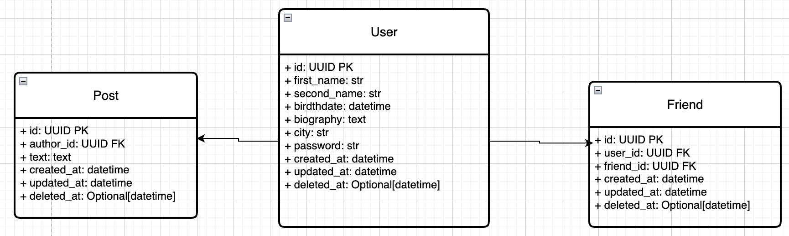
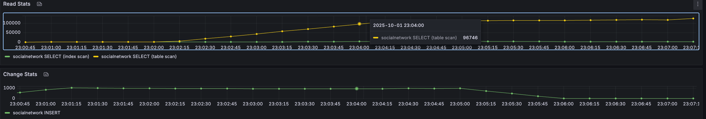

# 2025-10-01 Кэширование

## Задачи и методики

### Цель
- настроить кэширование ленты постов друзей пользователя. В ленте держать последние 1000 обновлений друзей
- проверить влияние кэша на производительность отображения ленты постов друзей

### Описание данных



- Для генерации записей реализован [генератор данных](https://github.com/Grin941/social-network/blob/main/src/data_generator/generator.py)
- Таблица пользователей содержит 100_000 записей
- На каждого пользователя генерируется от 20 до 30 постов
- Каждый пользователь имеет от 20 до 100 друзей
- Лента содержит посты друзей пользователей, отсортированные по created_at desc
- Кэш содержит 1000 записей постов друзей

### Формирование ленты

Алгоритм наполнения ленты
1. взять записи из кэша (в кэше всегда хранятся последние 1000 постов друзей, отсортированные по created_at desc)
2. если число записей в кэше < limit – добрать записи из БД

Запрос на формирование ленты
```sql
SELECT p.*
FROM posts p JOIN friends f ON p.author_id = f.user_id
WHERE p.author_id != :user_id
    AND f.friend_id = :user_id
    AND p.deleted_at IS NULL
    AND f.deleted_at IS NULL
ORDER BY p.created_at DESC
OFFSET :offser
LIMIT :limit
```

Производительность запроса
- Изначальный замер EXPLAIN ANALYSE показал cost=59254 и выполнялся от 3 до 13 секунд
- Сократить косты до 197 и время выполнения запроса до < 1 секунды помогли индексы
  - Post.author_id -> btree
  - Friend.user_id -> btree
  - Friend.friend_id -> btree

### Алгоритм кэширования
[Код](https://github.com/Grin941/social-network/blob/main/src/social_network/domain/services/feed.py)

Общие сведения
- кэш имеет ttl = 10 мин
- перед началом операций над кэшем берется блокирующий лок на 60 секунд, чтобы предотвратить конкурентное обновление кэша

Прогрев кэша
- кэш прогревается при запросе ленты, если кэш пуст
- кэш прогревается, если при добавлении нового поста в ленту истекает ttl кэша

Обновление кэша
- при добавлении поста у друзей автора кэш пополняется новым постом
- если в кэше уже была 1000 записей, самый старый пост предварительно удаляется из кэша

Инвалидация кэша
- по TTL
- при удалении поста инвалидируются ленты друзей автора (нужно удалить пост из их лент)
- при обновлении поста инвалидируются ленты друзей автора (нужно обновить пост в лентах друзей)
- при добавлении друга инвалидируется лента обоих новых друзей (нужно добавить посты друг друга в ленту новому другу)
- при удалении друга инвалидируется лента обоих бывших друзей (нужно удалить посты друг бывшего друга из ленты)

### Методика тестирования
- каждый тест проводится в 4 этапа
  - user: 1 / spawn_rate: 1 / duration: 60
  - user: 10 / spawn_rate: 1 / duration: 60
  - user: 100 / spawn_rate: 10 / duration: 90
  - user: 1000 / spawn_rate: 50 / duration: 90
- отношение `просмотр ленты:написание постов:обновление и удаление постов и друзей` = 100:10:1
- тестированию подвергаем операции
  - получение ленты постов
  - написание поста
  - обновление поста
  - удаление поста
  - добавление друга
  - удаление друга
- критерии приемки
  - кэширование ускоряет работу приложения
- мониторинг
  - всего запросов
  - ошибки
  - RPS (avg)
  - throughput (avg)
  - select/insert/update ratio
  - cache hit rate
- Тестовый стенд
  - асинхронный сервер [Gunicorn](https://gunicorn.org/), 1 worker
  - БД в одном экземпляре без репликации
  - тестирование проводится на локальном компьютере
    - Apple M2
    - 8 CPU
    - 16 RAM
    - HDD 1000Gb

План тестирования:
- тестирование без кэша
- тестирование с кэшем

## Проведение тестирования

### Тестирование без кэша

Собираем данные о работе системы под нагрузкой

#### Запуск теста

Запускаем приложение
```shell
set -a && source .env && set +a && docker compose -f devops/test_cache/docker-compose.no-cache.yaml up --build
```

Запускаем тест
```shell
set -a && source .env && set +a && locust -f tests/load/test_cache/locustfiles/base.py --timescale --headless
```

#### Информация о нагрузке

Всего сервер обработал 4215 запросов.

Число ошибок 649, что равно 15% от общего числа запросов


Cредний RPS = 17.
Начал падать после 150 пользователей.

Средняя пропускная способность feed = 15


Число SELECT держится на границе 750.000

| Configuration | RPS (50) | Throughput (50) | total queries | errors % | SELECT   | Cache Hit Rate |
|---------------|----------|-----------------|---------------|----------|----------|----------------|
| No Cache      | 17       | 15              | 4215          | 15       | 750.000  | -              |

### Тестирование с кэшем

#### Запуск теста

Запускаем приложение
```shell
set -a && source .env && set +a && docker compose -f devops/test_cache/docker-compose.cache.yaml up --build
```

Запускаем тест
```shell
set -a && source .env && set +a && locust -f tests/load/test_cache/locustfiles/base.py --timescale --headless
```

#### Информация о нагрузке

Всего сервер обработал 4354 запросов.

Число ошибок 726, что равно 17% от общего числа запросов


Cредний RPS = 15.
Начал падать после 100 пользователей до уровня прежнего графика, но дальше остался почти неизменным.

Средняя пропускная способность feed = 14



Число SELECT держится на границе 100.000


- avg hits = `(29.1 + 52.8 + 67 + 60.9 + 72.3 + 0.3 + 0.8 + 0.4 + 0.3 + 0.07) / 10 = 28.4 hit/s`
- avg misses = `(38 + 69 + 74.4 + 59.8 + 65.3 + 0.7 + 1 + 0.9 + 0.2 + 0.3) / 10 = 31 miss/s`
- avg commands = `(0.8 + 1.4 + 1.4 + 190 + 916 + 1060 + 1120 + 992 + 327 + 13.4 + 11.1 + 11 + 4.5) / 13 = 357 op/s`

| Configuration | RPS (50) | Throughput (50) | total queries | errors % | SELECT   | Cache Hit Rate  | Cache Miss Rate |
|---------------|----------|-----------------|---------------|----------|----------|-----------------|-----------------|
| Cache         | 15       | 14              | 4354          | 17       | 100.000  | 28 / 357 = 0.08 | 31 / 357 = 0.09 |

## Выводы

| Configuration | RPS (50)   | Throughput (50) | total queries | errors %  | SELECT         | Cache Hit Rate | Cache Miss Rate |
|---------------|------------|-----------------|---------------|-----------|----------------|----------------|-----------------|
| No Cache      | 17         | 15              | 4215          | 15        | 750.000        | -              | -               |
| Cache         | 15 (-12%)  | 14 (-7%)        | 4354 (+3%)    | 17 (+13%) | 100.000 (-87%) | 8%             | 9%              |

- наличие кэша никак не повлияло на производительность
- cache miss rate получился низким (9%)
- при том, что cache hit rate тоже низкий, кэширование позволило снизить количество обращений к бд (SELECT) на 87%
