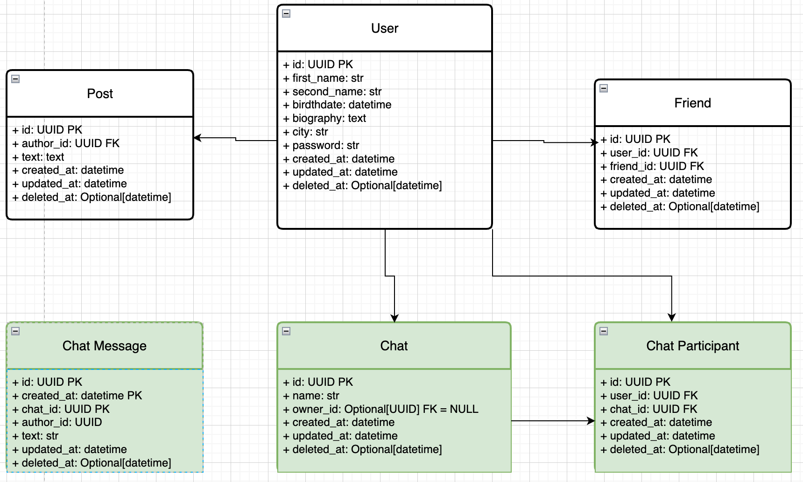
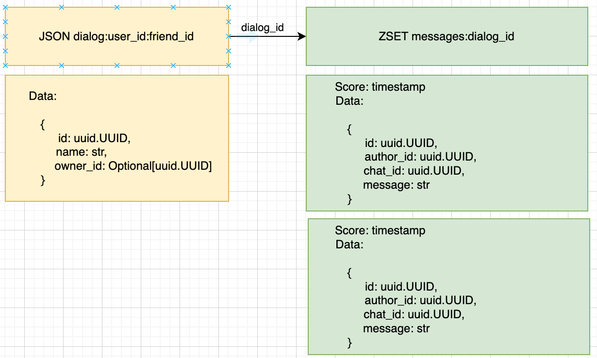

# 2025-10-26 In-Memory СУБД

## Цель задания
- Вынести хранение данных диалогов из SQL БД в In-Memory СУБД. Перенести логику из модуля в UDF в In-Memory СУБД.
- Провести нагрузочное тестирование модуля диалогов в SQL БД для дальнейшего сравнения
- Провести нагрузочное тестирование модуля диалогов в In-Memory СУБД
- Сравнить результаты нагрузочного тестирования

## Архитектура приложения

Данные в Postgres хранятся в такой структуре



Переносим данные диалогов в Redis



Структура данных
- храним метаданные чата JSON по ключу `dialog:user_id:friend_id`
- храним сообщения в упорядоченном сете ZSET по ключу `messages:dialog_id`
  - сообщения сортированы по timestamp публикации

Такая структура данных позволяет
- оперативно находить метаданные чата по идентификаторам переписывающихся пользователей
- оперативно находить сообщения чата по идентификатору чата

Алгоритм создания чата
1. находим друга по friend_id в Postgres,
2. если друг не найден, выбрасываем исключение FriendNotFoundError
2. вызываем UDF-процедуру `make_dialog`и по ключу `dialog:user_id:friend_id` записываем метаданные диалога `{id: uuid, name: str, owner_id: Optional[uuid]}`

Алгоритм написания сообщения
1. вызываем UDF-процедуру `get_dialog` и находим чат по ключу `dialog:user_id:friend_id` или `dialog:user_id:friend_id`
2. если чат не найден, выбрасываем исключение DialogNotFoundError
3. вызываем UDF-процедуру `write_message` и по ключу `messages:dialog_id` записываем сообщение `{id: uuid, author_id: uuid, chat_id: uuid, message: str}` с rang = creation timestamp

Алгоритм получения сообщений чата
1. вызываем UDF-процедуру `get_dialog` и находим чат по ключу `dialog:user_id:friend_id` или `dialog:user_id:friend_id`
2. если чат не найден, выбрасываем исключение DialogNotFoundError
3. вызываем UDF-процедуру `show_messages` и по ключу `messages:dialog_id` возвращаем сообщения `[{id: uuid, author_id: uuid, chat_id: uuid, message: str}]` с сортировкой по rang

## Нагрузочное тестирование

### Цель
- проверить влияние Redis UDF на ускорение получения диалогов
- проверить влияние Redis UDF на запись диалогов

### Методика тестирования
- каждый тест проводится в 4 этапа
  - user: 1 / spawn_rate: 1 / duration: 60
  - user: 10 / spawn_rate: 1 / duration: 60
  - user: 100 / spawn_rate: 10 / duration: 90
  - user: 1000 / spawn_rate: 50 / duration: 90
- отношение `просмотр чата:написание сообщений` = 2:1
- тестированию подвергаем операции
  - получение сообщений чата
  - написание сообщения в чат
- критерии приемки
  - шардирование ускоряет получение диалогов
  - шардирование не замедляет вставку новых сообщений
- мониторинг
  - всего запросов
  - ошибки
  - RPS (avg)
  - throughput (avg)
- Тестовый стенд
  - асинхронный сервер [Gunicorn](https://gunicorn.org/), 1 worker
  - БД в одном экземпляре без репликации
  - тестирование проводится на локальном компьютере
    - Apple M2
    - 8 CPU
    - 16 RAM
    - HDD 1000Gb

План тестирования:
- тестирование без Redis UDF
- тестирование с Redis UDF

## Проведение тестирования

### Тестирование без Redis UDF

Собираем данные о работе системы под нагрузкой

#### Запуск теста

Запускаем приложение
```shell
set -a && source .env && set +a && docker compose -f devops/test_in_memory_db/docker-compose.no-udf.yaml up --build
```

Запускаем тест
```shell
set -a && source .env && set +a && locust -f tests/load/test_in_memory_db/locustfiles/base.py --timescale --headless
```

#### Информация о нагрузке

Всего сервер обработал 8984 запросов.

Число ошибок 2, что равно 0.02% от общего числа запросов


Cредний RPS = 30.
Начал падать после 500 пользователей.

Средняя пропускная способность
- list_dialogs = 20
- send_message = 10


| Configuration | RPS (50) | Throughput (50) | total queries | errors %  |
|---------------|----------|-----------------|---------------|-----------|
| No Sharding   | 30       | 20/10           | 8984          | 0.02      |

### Тестирование с шардированием

#### Запуск теста

Запускаем приложение
```shell
set -a && source .env && set +a && docker compose -f devops/test_sharding/docker-compose.sharding.yaml up --build
```

Запускаем тест
```shell
set -a && source .env && set +a && locust -f tests/load/test_sharding/locustfiles/base.py --timescale --headless
```

Зайдем на citus_master и выполним запросы из tests/load/test_sharding/init_master.sql

#### Информация о нагрузке

Всего сервер обработал 1399 запросов.

Число ошибок 138, что равно 10% от общего числа запросов


Cредний RPS = 6.
Начал падать после 100 пользователей.

Средняя пропускная способность
- list_dialogs = 4
- send_message = 2


| Configuration | RPS (50) | Throughput (50) | total queries | errors % |
|---------------|----------|-----------------|---------------|----------|
| Sharding      | 6 (-80%) | 4/2 (-80%)      | 1399 (-85%)   | 10       |


### Тестирование с шардированием без партицирования

Есть гипотеза, что получение чатов работает медленнее из-за дополнительного партицирования шардов.

Проверим гипотезу, удалив партицирование таблицы chat_messages


#### Запуск теста

Запускаем приложение
```shell
set -a && source .env && set +a && docker compose -f devops/test_sharding/docker-compose.sharding.yaml up --build
```

Запускаем тест
```shell
set -a && source .env && set +a && locust -f tests/load/test_sharding/locustfiles/base.py --timescale --headless
```

Зайдем на citus_master и выполним запрос create_distributed_table из tests/load/test_sharding/init_master.sql

#### Информация о нагрузке

Всего сервер обработал 1184 запросов.

Число ошибок 7, что равно 0.6% от общего числа запросов


Cредний RPS = 6.
Начал падать после 100 пользователей.

Средняя пропускная способность
- list_dialogs = 4
- send_message = 2


| Configuration            | RPS (50) | Throughput (50) | total queries | errors % |
|--------------------------|----------|-----------------|---------------|----------|
| Sharding No Partitioning | 6 (-80%) | 4/2 (-80%)      | 1184 (-87%)   | 0.6      |

Master-нода при этом отдает ошибки


## Выводы

| Configuration            | RPS (50) | Throughput (50) | total queries | errors %   |
|--------------------------|----------|-----------------|---------------|------------|
| No Sharding              | 30       | 20/10           | 8984          | 0.02       |
| Sharding                 | 6 (-80%) | 4/2 (-80%)      | 1399 (-85%)   | 10         |
| Sharding No Partitioning | 6 (-80%) | 4/2 (-80%)      | 1184 (-87%)   | 0.6        |

- шардирование сократило производительность системы на 80%
- партицирование шардов на это никак не повлияло
- сервер стал возвращать ошибки подключения
- предполагаю, что дело в балансировщике нагрузки между кластером citus и приложением
