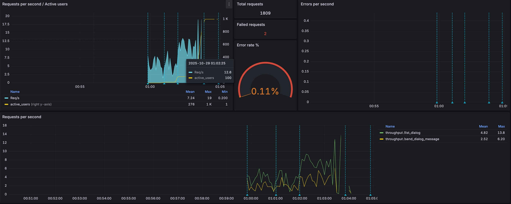

# 2025-10-26 In-Memory СУБД

## Цель задания
- Вынести хранение данных диалогов из SQL БД в In-Memory СУБД. Перенести логику из модуля в UDF в In-Memory СУБД.
- Провести нагрузочное тестирование модуля диалогов в SQL БД для дальнейшего сравнения
- Провести нагрузочное тестирование модуля диалогов в In-Memory СУБД
- Сравнить результаты нагрузочного тестирования

## Архитектура приложения

Данные в Postgres хранятся в такой структуре


Переносим данные диалогов в Redis


Структура данных
- храним метаданные чата JSON по ключу `dialog:user_id:friend_id`
- храним сообщения в упорядоченном сете ZSET по ключу `messages:dialog_id`
  - сообщения сортированы по timestamp публикации

Такая структура данных позволяет
- оперативно находить метаданные чата по идентификаторам переписывающихся пользователей
- оперативно находить сообщения чата по идентификатору чата

Алгоритм создания чата
1. [находим](https://github.com/Grin941/social-network/blob/main/src/social_network/domain/services/chat.py#L53) друга по friend_id в Postgres,
2. если друг не найден, [выбрасываем исключение](https://github.com/Grin941/social-network/blob/main/src/social_network/domain/services/chat.py#L54) FriendNotFoundError
2. вызываем [UDF-процедуру](https://github.com/Grin941/social-network/blob/main/src/social_network/infrastructure/redis_udf/redis_udf.lua#L3) `make_dialog`и по ключу `dialog:user_id:friend_id` записываем метаданные диалога `{id: uuid, name: str, owner_id: Optional[uuid]}`

Алгоритм написания сообщения
1. вызываем [UDF-процедуру](https://github.com/Grin941/social-network/blob/main/src/social_network/infrastructure/redis_udf/redis_udf.lua#L13) `get_dialog` и находим чат по ключу `dialog:user_id:friend_id` или `dialog:user_id:friend_id`
2. если чат не найден, [выбрасываем исключение](https://github.com/Grin941/social-network/blob/main/src/social_network/domain/services/chat.py#L87) DialogNotFoundError
3. вызываем [UDF-процедуру](https://github.com/Grin941/social-network/blob/main/src/social_network/infrastructure/redis_udf/redis_udf.lua#L19) `write_message` и по ключу `messages:dialog_id` записываем сообщение `{id: uuid, author_id: uuid, chat_id: uuid, message: str}` с rang = creation timestamp

Алгоритм получения сообщений чата
1. вызываем [UDF-процедуру](https://github.com/Grin941/social-network/blob/main/src/social_network/infrastructure/redis_udf/redis_udf.lua#L13) `get_dialog` и находим чат по ключу `dialog:user_id:friend_id` или `dialog:user_id:friend_id`
2. если чат не найден, [выбрасываем исключение](https://github.com/Grin941/social-network/blob/main/src/social_network/domain/services/chat.py#L108) DialogNotFoundError
3. вызываем [UDF-процедуру](https://github.com/Grin941/social-network/blob/main/src/social_network/infrastructure/redis_udf/redis_udf.lua#L30) `show_messages` и по ключу `messages:dialog_id` возвращаем сообщения `[{id: uuid, author_id: uuid, chat_id: uuid, message: str}]` с сортировкой по rang

## Нагрузочное тестирование

### Цель
- проверить влияние Redis UDF на ускорение получения диалогов
- проверить влияние Redis UDF на запись диалогов

### Методика тестирования
- каждый тест проводится в 4 этапа
  - user: 1 / spawn_rate: 1 / duration: 60
  - user: 10 / spawn_rate: 1 / duration: 60
  - user: 100 / spawn_rate: 10 / duration: 90
  - user: 1000 / spawn_rate: 50 / duration: 90
- отношение `просмотр чата:написание сообщений` = 2:1
- тестированию подвергаем операции
  - получение сообщений чата
  - написание сообщения в чат
- критерии приемки
  - шардирование ускоряет получение диалогов
  - шардирование не замедляет вставку новых сообщений
- мониторинг
  - всего запросов
  - ошибки
  - RPS (avg)
  - throughput (avg)
- Тестовый стенд
  - асинхронный сервер [Gunicorn](https://gunicorn.org/), 1 worker
  - БД в одном экземпляре без репликации
  - тестирование проводится на локальном компьютере
    - Apple M2
    - 8 CPU
    - 16 RAM
    - HDD 1000Gb

План тестирования:
- тестирование без Redis UDF
- тестирование с Redis UDF

## Проведение тестирования

### Тестирование без Redis UDF

Собираем данные о работе системы под нагрузкой

#### Запуск теста

Запускаем приложение
```shell
set -a && source .env && set +a && docker compose -f devops/test_in_memory_db/docker-compose.no-udf.yaml up --build
```

Запускаем тест
```shell
set -a && source .env && set +a && locust -f tests/load/test_in_memory_db/locustfiles/base.py --timescale --headless
```

#### Информация о нагрузке

Всего сервер обработал 1259 запросов.

Число ошибок 4, что равно 0.32% от общего числа запросов


Cредний RPS = 5.4.
Начал падать после 500 пользователей.

Средняя пропускная способность
- list_dialogs = 3.5
- send_message = 1.9


99 персентиль времени ответа от сервера
- list_dialogs = 18.4 sec
- send_message = 16.7 sec

| Configuration | RPS (50) | Throughput (50) | Response (99)  | total queries | errors %   |
|---------------|----------|-----------------|----------------|---------------|------------|
| No UDF        | 5.4      | 3.5/1.9         | 18.4/16.7      | 1259          | 0.32       |

### Тестирование с Redis UDF

#### Запуск теста

Запускаем приложение
```shell
set -a && source .env && set +a && docker compose -f devops/test_in_memory_db/docker-compose.udf.yaml up --build
```

Запускаем тест
```shell
set -a && source .env && set +a && locust -f tests/load/test_in_memory_db/locustfiles/base.py --timescale --headless
```

Зайдем на redis и подгрузим lua-скрипты `redis-cli FUNCTION LOAD "$(cat /usr/local/etc/redis/scripts/redis_udf.lua)"`

#### Информация о нагрузке

Всего сервер обработал 1809 запросов.

Число ошибок 2, что равно 0.1% от общего числа запросов



Cредний RPS = 7.2.
Начал падать после 800 пользователей.

Средняя пропускная способность
- list_dialogs = 4.8
- send_message = 2.5


99 персентиль времени ответа от сервера
- list_dialogs = 7.8 sec
- send_message = 8.3 sec


Нагрузка на Redis представлена на графике выше


| Configuration | RPS (50)    | Throughput (50)    | Response (99)        | total queries | errors %   |
|---------------|-------------|--------------------|----------------------|---------------|------------|
| Redis UDF     | 7.2 (+33%)  | 4.8/2.5 (+37/+31%) | 7.8/8.3 (-58/-50%) | 1809 (+43%)   | 0.1 (-66%) |


## Выводы

| Configuration | RPS (50)   | Throughput (50)    | Response (99)        | total queries | errors %   |
|---------------|------------|--------------------|----------------------|---------------|------------|
| No UDF        | 5.4        | 3.5/1.9            | 18.4/16.7            | 1259          | 0.32       |
| Redis UDF     | 7.2 (+33%) | 4.8/2.5 (+37/+31%) | 7.8/8.3 (-58/-50%)   | 1809 (+43%)   | 0.1 (-66%) |

- использование In-memory СУБД повысило производительность системы более чем на треть
- время ответа клиенту от сервера сократилось вдвое
- число ошибок от сервера сократилось более чем в 2 раза
