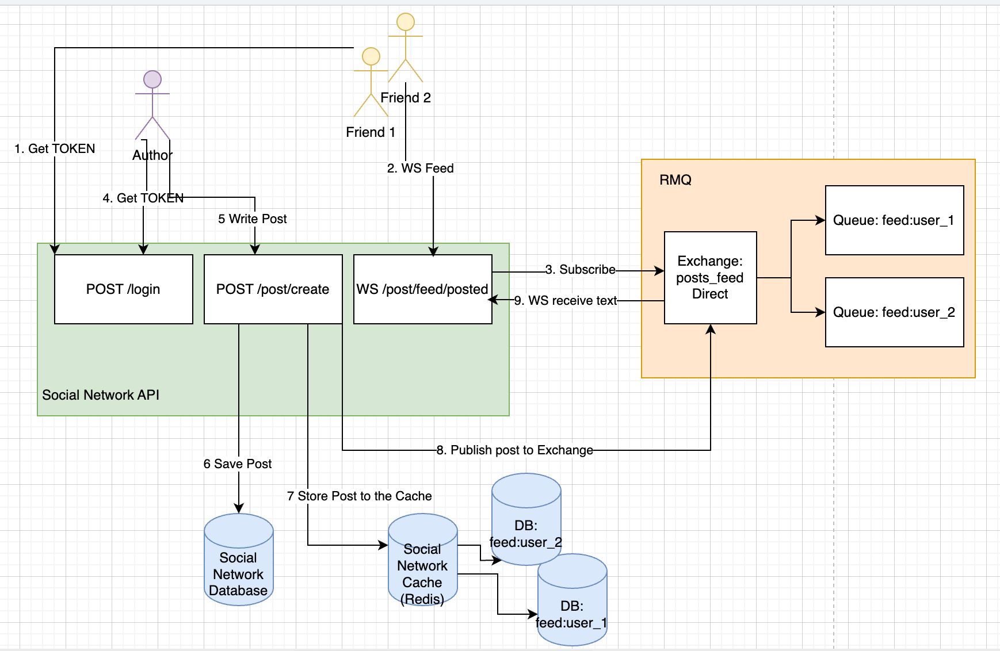
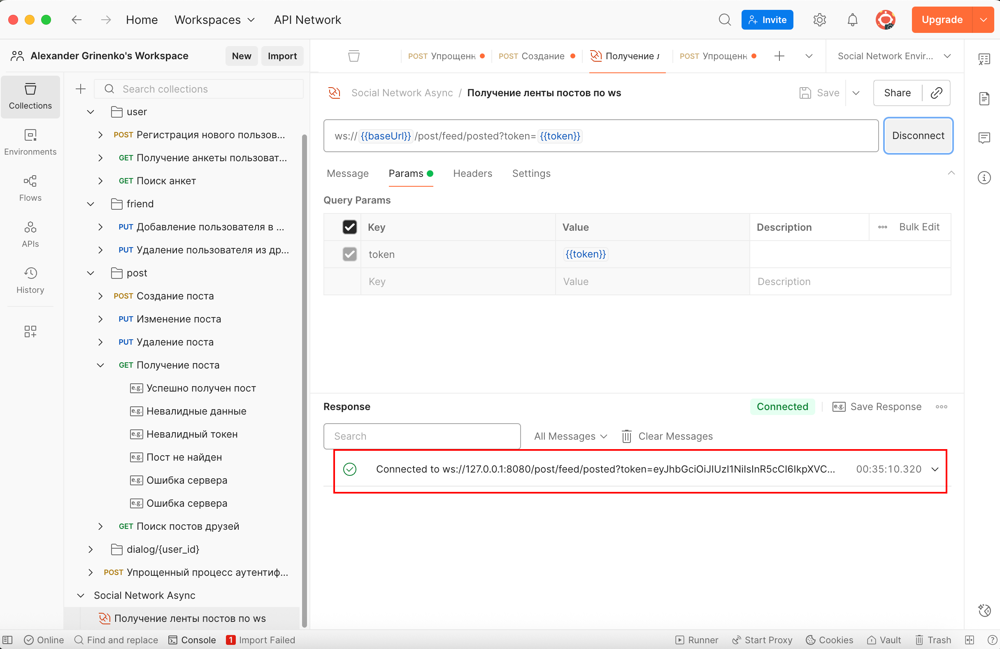
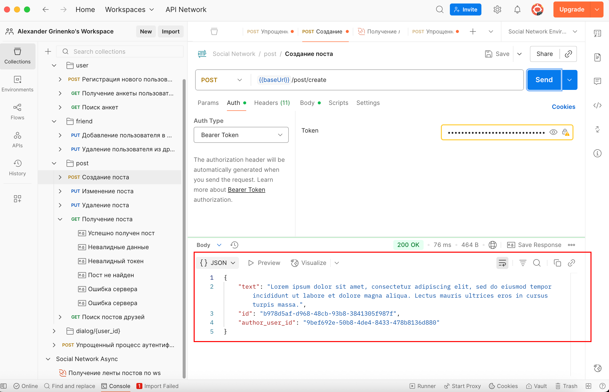
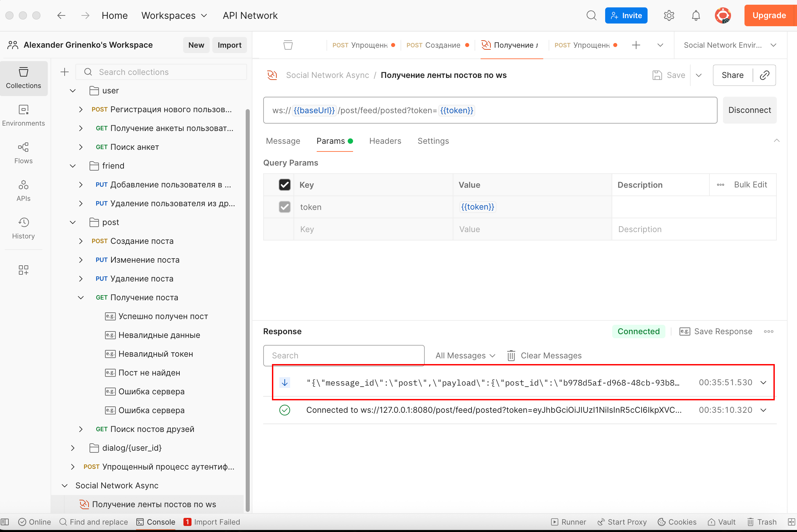
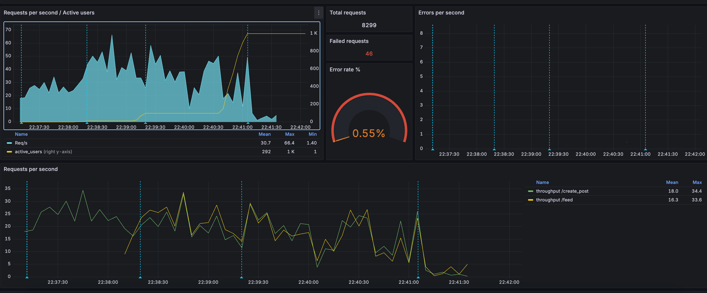
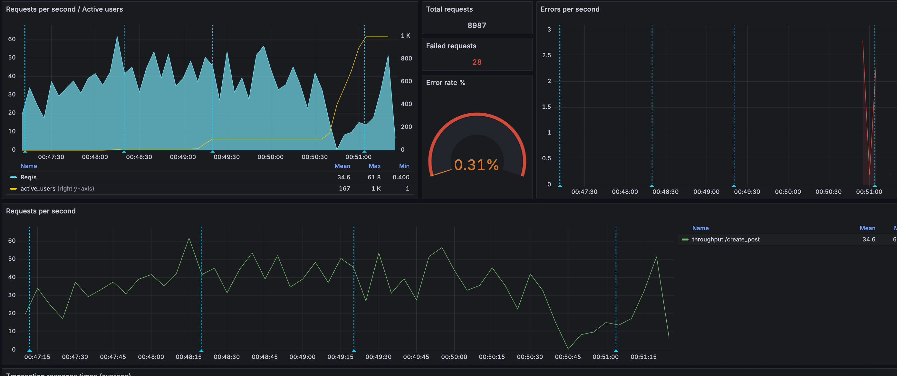
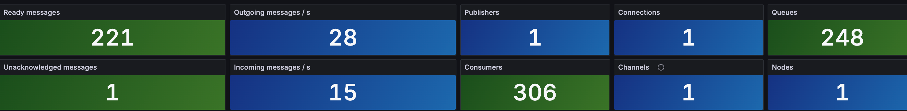
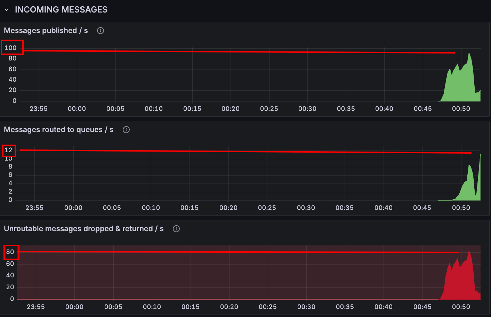

# 2025-10-13 Очереди и отложенное выполнение

## Цель задания
- Разработать WebSocket сервер, при помощи которого подключенные клиенты будут сразу получать обновления постов своих друзей
- Реализовать асинхронное API с websocket
- Реализовать отложенную материализацию ленты
  - Формирование лент работает через очередь (отложено)
  - При реализации обязательно обеспечить отправку только целевым пользователям это событие
- Предусмотреть “Эффект Леди Гаги” (один пользователь пишет сильно больше среднего)
  - Можно взять подход twitter - пользователи делятся на селебрити и обычных.
  - Для селебрити они просто добавляют посты, для обычных - добавляют посты и обновляют ленту

## Архитектура приложения



Алгоритм составления ленты
1. пользователи - друзья автора логинятся и получают JWT-token `POST /login`
2. пользователи посылают запрос на открытие вэб-сокета: `WS /post/feed/posted?token=<token>`
3. приложение подписывает пользователя на обновление ленты
   - открывается сокет
   - создается RMQ очередь `feed:{user_id}`
   - очередь биндится по routing key `feed:{user_id}`
4. пользователь-автор авторизуется и получает JWT-token `POST /login`
5. пользователь автор публикует пост `POST /post/create`
6. пост сохраняется в БД
7. приложение кэширует пост и добавляет его в ленту каждому другу пользователя (см [домашку по кэшам](https://github.com/Grin941/social-network/tree/main/tests/load/test_cache))
8. для каждого друга автора в RMQ публикуется сообщение (postId, postText, author_user_id) по routing key `feed:{friend_id}`
9. друзья автора получают новый пост по вэб-сокету
   - каждый сокет связан со своей очередью (binding по routing_key, зависящему от user id)
   - таким образом, обеспечиваем отправку поста только целевым пользователям (друзьям)
   - на очередь навешен коллбэк, который сериализует новый пост из очереди и отправляет его в сокет

Эффект Леди Гаги
- после 6 шага алгоритма приложение получает список друзей пользователей
- если количество друзей пользователя превышает `CELEBRITY_FRIENDS_THRESHOLD` (500 друзей по умолчанию), считаем что пользователь селебрити
  - не обновляем ленту его друзей в очереди
  - не обновляем ленту его друзей в кэше
- в противном случае переходим к шагу 7

### Масштабирование

- каждый пользователь (по сути, каждое ws-соединение) слушает свою durable-очередь, соответственно, можем держать столько WS-соединений, сколько позволит IO/Disk для поддержания очередей
- при росте нагрузки можем поддерживать очереди RMQ в кластере позади HaProxy

### Демонстрация работы сокетов

1. Подключимся к сокету ленты новостей от лица пользователя



2. Напишем пост от лица его друга



3. Убедимся, что пост дошел до первого пользователя через вэб-сокет соединение



## Нагрузочное тестирование

### Цель
- проверить влияние очередей на запись постов
- проверить влияние очередей на формирование ленты

### Описание данных

- Для генерации записей реализован [генератор данных](https://github.com/Grin941/social-network/blob/main/src/data_generator/generator.py)
- Таблица пользователей содержит 100_000 записей
- Каждый пользователь имеет от 20 до 1000 друзей
- Каждый пользователь пишет от 20 до 30 постов

Алгоритм теста устроен таким образом, что мы выбираем случайного пользователя, который подключается к сокету и случайного пользователя, который пишет пост.

Соответственно, не всегда на посты пользователя кто-то будет подписан, и не всегда пользователь, подписанный на новости друга получит от него пост – имитируем бесполезную нагрузку

### Методика тестирования
- каждый тест проводится в 4 этапа
  - user: 1 / spawn_rate: 1 / duration: 60
  - user: 10 / spawn_rate: 1 / duration: 60
  - user: 100 / spawn_rate: 10 / duration: 90
  - user: 1000 / spawn_rate: 50 / duration: 90
- в первом тесте без очередей отношение `просмотр ленты:написание постов` = 10:1
- во втором тесте с очередями каждый пользователь теста подключается к сокету, как случайный пользователь приложения
- тестированию подвергаем операции
  - получение ленты сообщений из кэша в отсутствии очередей
  - получение ленты сообщений по WS при наличии очередей
  - публикация поста
- критерии приемки
  - очереди ускоряют получение ленты новостей
  - очереди не замедляет вставку новых постов
- мониторинг
  - всего запросов
  - ошибки
  - RPS (avg)
  - throughput (avg)
  - метрики RMQ
- Тестовый стенд
  - асинхронный сервер [Gunicorn](https://gunicorn.org/), 1 worker
  - БД в одном экземпляре без репликации
  - тестирование проводится на локальном компьютере
    - Apple M2
    - 8 CPU
    - 16 RAM
    - HDD 1000Gb

План тестирования:
- тестирование без очередей (лента на кэшах)
- тестирование с очередями (лента на вэб-сокетах)

## Проведение тестирования

### Тестирование без очередей (лента на кэшах)

Собираем данные о работе системы под нагрузкой

#### Запуск теста

Запускаем приложение
```shell
set -a && source .env && set +a && docker compose -f devops/test_queues/docker-compose.queues-disabled.yaml up --build
```

Запускаем тест
```shell
set -a && source .env && set +a && locust -f tests/load/test_queues/locustfiles/http.py --timescale --headless
```

#### Информация о нагрузке

Всего сервер обработал 8299 запросов.

Число ошибок 46, что равно 0.55% от общего числа запросов



Cредний RPS = 31.
Начал падать после 800 пользователей.

Средняя пропускная способность
- create_post = 18
- feed = 16


| Configuration          | RPS (50) | Throughput (50) | total queries | errors % |
|------------------------|----------|-----------------|---------------|----------|
| No Queues (only cache) | 31       | 18/16           | 8299          | 0.55     |

### тестирование с очередями (лента на вэб-сокетах)

#### Запуск теста

Запускаем приложение
```shell
set -a && source .env && set +a && docker compose -f devops/test_queues/docker-compose.queues-enabled.yaml up --build
```

Запускаем тест
```shell
set -a && source .env && set +a && locust -f tests/load/test_queues/locustfiles/ws.py --timescale --headless
```

#### Информация о нагрузке

Всего сервер обработал 8987 запросов.

Число ошибок 28, что равно 0.31% от общего числа запросов



Cредний RPS = 35.
Начал падать после 800 пользователей.

Средняя пропускная способность
- create_post = 35
- feed -> информации нет, потому что каждый пользователь открывает только одно WS-соединение, нагрузку здесь дать не получится


| Configuration | RPS (50)  | Throughput (50) | total queries | errors %    |
|---------------|-----------|-----------------|---------------|-------------|
| Queues        | 35 (+12%) | 35 (+94%)       | 8987 (+8%)    | 0.31 (-46%) |


Посмотрим на работу ленты новостей на метриках от RMQ



Видно, что очереди создавались (пользователи открывали сокеты) и обрабатывали сообщения.



При этом можно заметить, как сработало случайное распределение пользователей:
- только 20% нагрузки была полезной
- 80% сообщений не находило адресата – пользователь писал пост, а его друзья не слушали очередь

## Выводы

| Configuration            | RPS (50)   | Throughput (50) | total queries | errors %     |
|--------------------------|------------|-----------------|---------------|--------------|
| No Queues (only cache)   | 31         | 18/16           | 8299          | 0.55         |
| Queues                   | 35 (+12%)  | 35 (+94%)       | 8987 (+8%)    | 0.31 (-46%)  |

- перевод ленты новостей с кэша на очереди увеличило производительность системы
- такой переход не только не сказался негативно на записи постов, но и улучшил пропускную способность записи постов
- при этом большая часть нагрузки на RMQ делается вхолостую (рассылаем пост всем друзьям пользователя, но очереди, забиндиной на routing key друга нет, так как тот не слушает сокет новостей)
