# 2025-10-05 Шардирование

## Цель задания
- Обеспечить горизонтальное масштабирование хранилищ на запись с помощью шардинга.
- Предусмотреть:
  - Возможность решардинга
  - “Эффект Леди Гаги” (один пользователь пишет сильно больше среднего)
  - Наиболее эффективную схему.

## Модель данных

### Предметная область

[Код](https://github.com/Grin941/social-network/blob/main/src/social_network/domain/services/chat.py)

Когда между пользователями устанавливается дружба,
создается чат-диалог на двух пользователей.

Алгоритм публикации сообщения в диалог
1. пользователь отправляет сообщение и user_id друга, кому хочет отправить сообщение
2. ищем чат с двумя участниками request_user.id и user_id
3. если чат не найден, возвращаем 400
4. сохраняем в бд ChatMessage с author_id=request_user.id и chat_id=chat.id

Алгоритм просмотра сообщений диалога
1. пользователь отправляет сообщение и user_id друга, кому хочет отправить сообщение
2. ищем чат с двумя участниками request_user.id и user_id
3. если чат не найден, возвращаем 400
4. возвращаем ChatMessage с chat_id=chat.id ORDER BY created_at DESC

### Описание данных


- Для генерации записей реализован [генератор данных](https://github.com/Grin941/social-network/blob/main/src/data_generator/generator.py)
- Таблица пользователей содержит 100_000 записей
- Каждый пользователь имеет от 20 до 1000 друзей
- С каждым другом автоматически создается чат-диалог
- Связь m2m между пользователем и чатом разрешается через модель ChatParticipant
- Проиндексированы FK
  - ChatParticipant.user_id
  - ChatParticipant.chat_id
- Модель СhatMessage содержит составной PK ('id', 'chat_id', 'created_at') – нужно для партиционирования и шардирования таблицы, описание ниже.

## Шардирование

### Выбор ключа шардирования

Считаем, что число чатов растет +- линейно с ростом числа пользователей (диалоги + групповые чаты, которые создаются в количестве, несопоставимо меньшем, чем число новых сообщений в чатах), поэтому не будем шардировать таблицу chat_participants.

В противном случае
- будем терять производительность на джойнах разных шардов participants_1024_shards JOIN chat_messages_111_shards
- можно делать таблицу chat_participants референсной и дублировать на все шард-ноды. Но в этом случае придется выполнять запрос поиска чата по участникам на всех шард-нодах
- делать таблицы chat_messages и chat_participants collocated также не имеет смысла, так как заранее мы не знаем, в каком чате состоят два наших пользователя

Предположим, имеем 100_000 пользователей, у каждого по 1000 друзей – получим, что может быть
 - не больше 100_000_000 друзей
 - то есть не больше 100_000_000 чатов
 - не больше 200_000_000 строк в таблице chat_participants (пока считаем, что чаты – только диалоги)

Проверим производительность запроса на поиск чата по участникам
```sql
EXPLAIN ANALYZE
SELECT chat_id
FROM chat_participants
WHERE user_id IN ('9bef692e-50b8-4de4-8433-478b8136d880', '2940d4f8-d073-414a-8389-e9479ed3cc05')
GROUP BY chat_id
HAVING COUNT(*) = 2;
```


- Cost = 281-289
- Execution Time: 0.513 ms

Получается, что таблицу chat_participants можно не шардировать
- ищем чат по большой локальной таблице chat_participants
- шардируем только chat_messages
- выбираем сообщения из шарда при этом исключаем джойны

Выбираем в качестве Shard key hash(chat_id)
- chat_id имеет высокую кардинальность, поэтому даст хорошее распределение ключей
- chat_id имеет низкую волатильность (не изменяется), что хорошо для ключа шардирования, потому что исключает его перерасчет.

Существует проблема, когда один пользователь пишет сильно больше среднего. В таком случае записи будут распределяться по шардам неравномерно, несмотря на хорошо выбранный ключ шардирования (в каком-то чате записей будет больше, чем в среднем по остальным шардам).

Для решения проблемы предлагаю партицировать шардированные таблицы по 1 day range.

Такой функционал доступен в Citus с версии [10.2](https://www.citusdata.com/blog/2021/10/22/how-to-scale-postgres-for-time-series-data-with-citus/)
Планируем, что даже в рамках одного шарда записи будут разлетаться по разным таблицам (таблицы партицируются посуточно).

### Алгоритм шардирования

Дано:
- Postgresql / Citus
- 1 мастер
- 1 менеджер
- 1 воркер

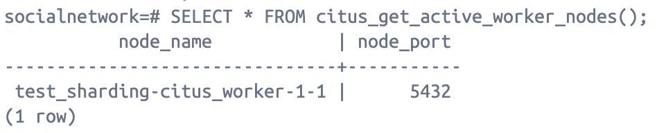

Опишем предложение по шардированию таблицы chat_participants

1. создаем таблицу chat_messages
```sql
CREATE TABLE chat_messages (
	id UUID NOT NULL,
	created_at TIMESTAMP WITH TIME ZONE NOT NULL,
	author_id UUID NOT NULL,
	chat_id UUID NOT NULL,
	text VARCHAR(256) NOT NULL,
	deleted_at TIMESTAMP WITH TIME ZONE,
	updated_at TIMESTAMP WITH TIME ZONE NOT NULL,
	PRIMARY KEY (id, chat_id, created_at)
) PARTITION BY RANGE (created_at)
```

Для того, чтобы партицировать таблицу, поле created_at должно быть частью составного PK ('id', 'created_at')

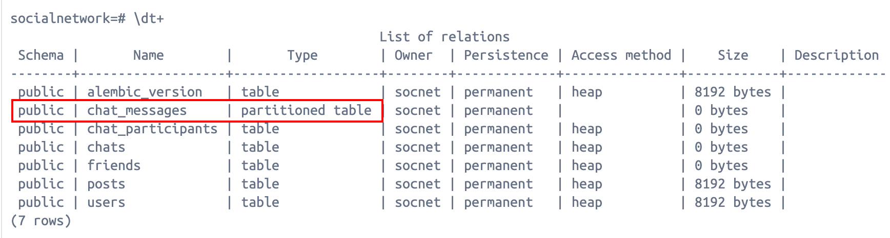

2. создаем в citus на мастере партиции по дням
```sql
SELECT create_time_partitions(table_name:= 'chat_messages',
    partition_interval:= '1 day',
    end_at:= '2025-10-30',
    start_from:= '2025-10-01');
```

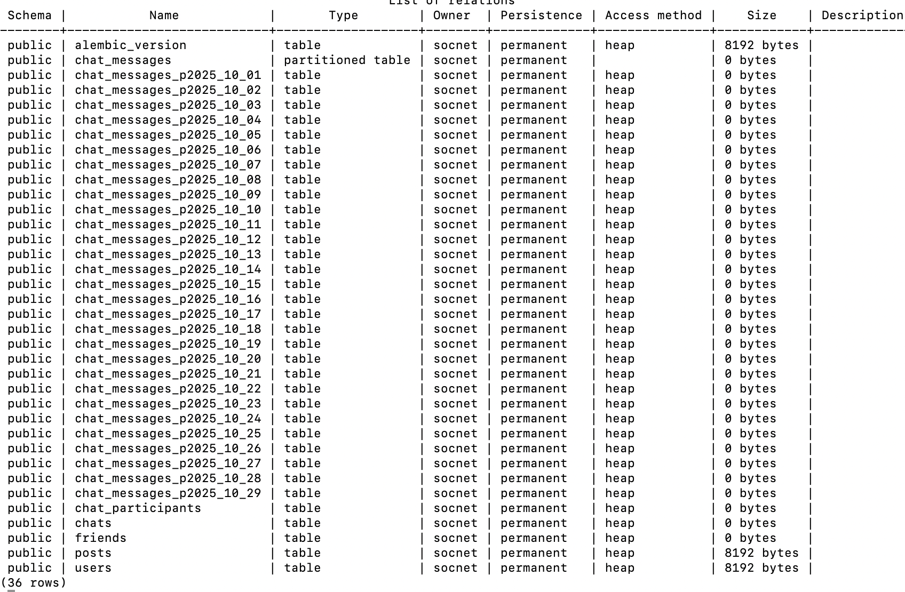

3. Шардируем партиционированную таблицу chat_messages по ключу-шардирования chat_id методом hash

Для того, чтобы шардировать таблицу, поле chat_id должно быть частью составного PK ('id', 'chat_id', 'created_at')

```sql
SELECT create_distributed_table('chat_messages', 'chat_id', 'hash');
```

Проверим план запроса на поиск сообщений
```sql
EXPLAIN ANALYZE
SELECT *
FROM chat_messages
WHERE chat_id = '9bef692e-50b8-4de4-8433-478b8136d880'
ORDER BY created_at DESC
```

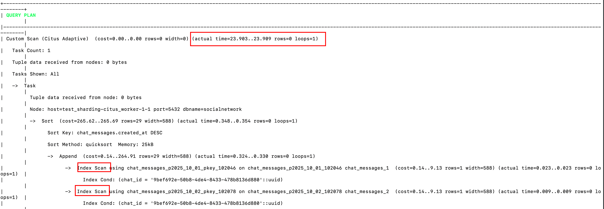

- Index Scan
- Task Count = 1
- Execution Time: 22 ms

Таким образом наш кластер шардов выглядит так

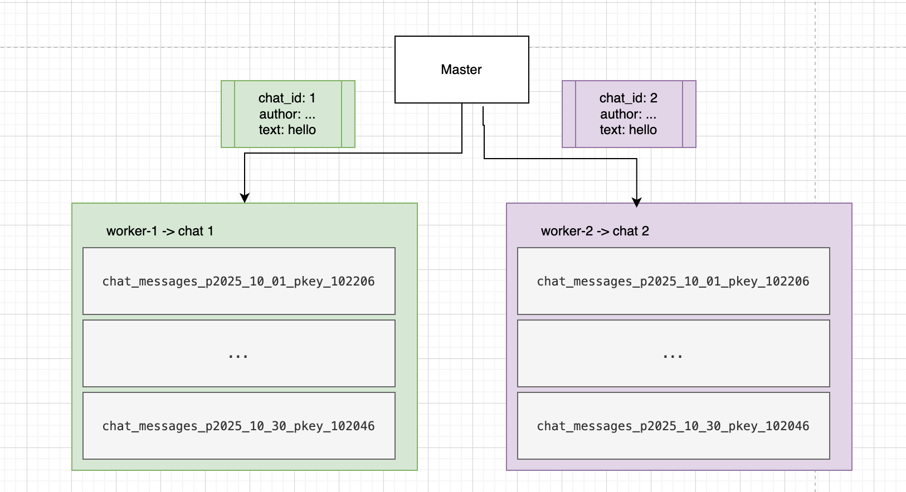

## Ребалансировка кластера

### Алгоритм ребалансировки

Citus, начиная с версии [11.0](https://docs.citusdata.com/en/stable/admin_guide/cluster_management.html#rebalance-shards-without-downtime) позволяет ребалансировать шарды без простоя.

Для этого нужно вызвать функцию citus_rebalance_start
```sql
SELECT citus_rebalance_start();
```

Функция асинхронно начнет переписывать данные, паралельно перенося данные с нескольких шардов.

Нодам выставляются веса и данные переносятся с ноды на новую ноду в объеме, рассчитанном в соответствии с весом.

Возможно применение нескольких [стратегий](https://docs.citusdata.com/en/stable/develop/api_metadata.html#rebalancer-strategy-table), определяющих шарды, с которых нужно переливать данные
- by_shard_count – выставляет вес ноде по количеству шардов на ней
- by_disk_size – выставляет вес в соответстии с занимаемым метом на диске
- возможны кастомные стратегии, например, cost_of_shard_by_number_of_queries

### Тестируем ребалансировку

Запустим бутстрап и наполним данными кластер

Проверим распределение записей по шардам
```sql
SELECT nodename, count(*) FROM citus_shards GROUP BY nodename;
```

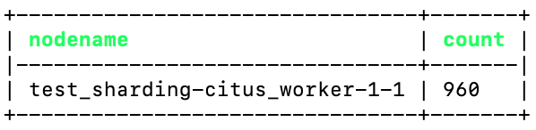

Подключим вторую worker-ноду

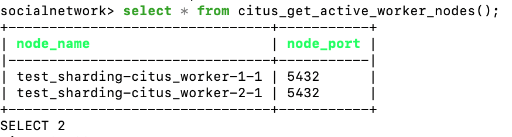

Ребалансируем шарды
```sql
SELECT citus_rebalance_start();
```

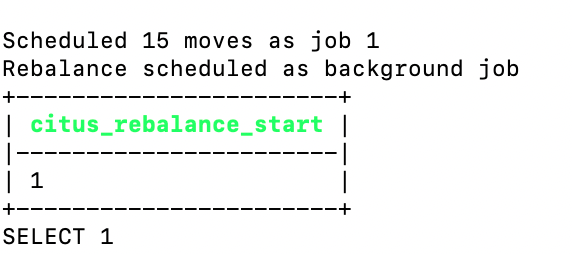

Проверяем, что ребалансировка завершена и данные распределились по шардам

```sql
SELECT started_at, finished_at, details FROM citus_rebalance_status();
```

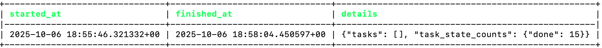

```sql
SELECT nodename, count(*) FROM citus_shards GROUP BY nodename;
```

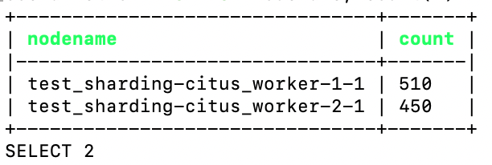

## Нагрузочное тестирование

### Цель
- проверить влияние шардирования на ускорение получения диалогов
- проверить влияние шардирования на запись диалогов

### Методика тестирования
- каждый тест проводится в 4 этапа
  - user: 1 / spawn_rate: 1 / duration: 60
  - user: 10 / spawn_rate: 1 / duration: 60
  - user: 100 / spawn_rate: 10 / duration: 90
  - user: 1000 / spawn_rate: 50 / duration: 90
- отношение `просмотр чата:написание сообщений` = 2:1
- тестированию подвергаем операции
  - получение сообщений чата
  - написание сообщения в чат
- критерии приемки
  - шардирование ускоряет получение диалогов
  - шардирование не замедляет вставку новых сообщений
- мониторинг
  - всего запросов
  - ошибки
  - RPS (avg)
  - throughput (avg)
- Тестовый стенд
  - асинхронный сервер [Gunicorn](https://gunicorn.org/), 1 worker
  - БД в одном экземпляре без репликации
  - тестирование проводится на локальном компьютере
    - Apple M2
    - 8 CPU
    - 16 RAM
    - HDD 1000Gb

План тестирования:
- тестирование без шардирования
- тестирование с шардированием

## Проведение тестирования

### Тестирование без шардирования

Собираем данные о работе системы под нагрузкой

#### Запуск теста

Запускаем приложение
```shell
set -a && source .env && set +a && docker compose -f devops/test_sharding/docker-compose.no-sharding.yaml up --build
```

Запускаем тест
```shell
set -a && source .env && set +a && locust -f tests/load/test_sharding/locustfiles/base.py --timescale --headless
```

#### Информация о нагрузке

Всего сервер обработал 8984 запросов.

Число ошибок 2, что равно 0.02% от общего числа запросов

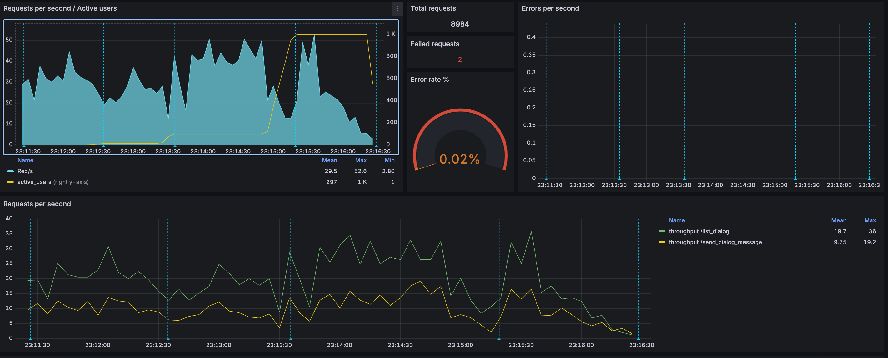

Cредний RPS = 30.
Начал падать после 500 пользователей.

Средняя пропускная способность
- list_dialogs = 20
- send_message = 10


| Configuration | RPS (50) | Throughput (50) | total queries | errors %  |
|---------------|----------|-----------------|---------------|-----------|
| No Sharding   | 30       | 20/10           | 8984          | 0.02      |

### Тестирование с шардированием

#### Запуск теста

Запускаем приложение
```shell
set -a && source .env && set +a && docker compose -f devops/test_sharding/docker-compose.sharding.yaml up --build
```

Запускаем тест
```shell
set -a && source .env && set +a && locust -f tests/load/test_sharding/locustfiles/base.py --timescale --headless
```

Зайдем на citus_master и выполним запросы из tests/load/test_sharding/init_master.sql

#### Информация о нагрузке

Всего сервер обработал 1399 запросов.

Число ошибок 138, что равно 10% от общего числа запросов

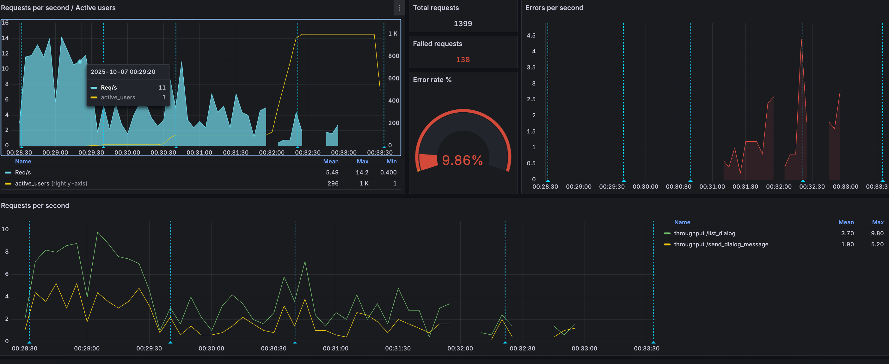

Cредний RPS = 6.
Начал падать после 100 пользователей.

Средняя пропускная способность
- list_dialogs = 4
- send_message = 2


| Configuration | RPS (50) | Throughput (50) | total queries | errors % |
|---------------|----------|-----------------|---------------|----------|
| Sharding      | 6 (-80%) | 4/2 (-80%)      | 1399 (-85%)   | 10       |


### Тестирование с шардированием без партицирования

Есть гипотеза, что получение чатов работает медленнее из-за дополнительного партицирования шардов.

Проверим гипотезу, удалив партицирование таблицы chat_messages

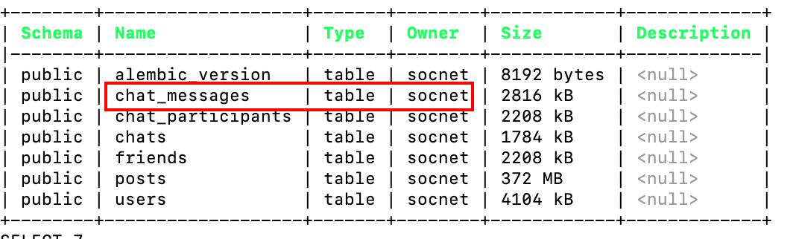

#### Запуск теста

Запускаем приложение
```shell
set -a && source .env && set +a && docker compose -f devops/test_sharding/docker-compose.sharding.yaml up --build
```

Запускаем тест
```shell
set -a && source .env && set +a && locust -f tests/load/test_sharding/locustfiles/base.py --timescale --headless
```

Зайдем на citus_master и выполним запрос create_distributed_table из tests/load/test_sharding/init_master.sql

#### Информация о нагрузке

Всего сервер обработал 1184 запросов.

Число ошибок 7, что равно 0.6% от общего числа запросов

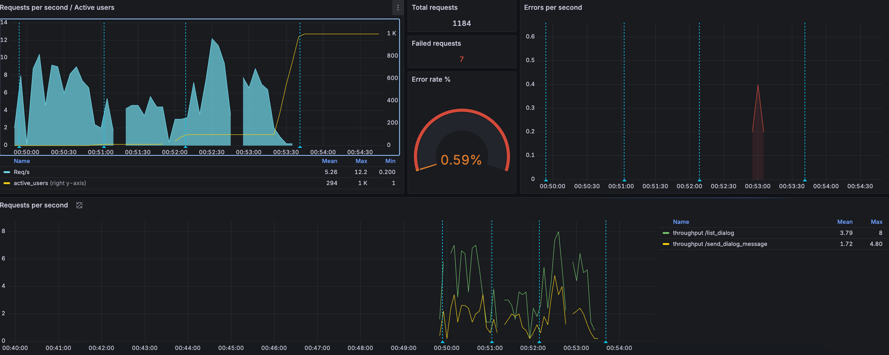

Cредний RPS = 6.
Начал падать после 100 пользователей.

Средняя пропускная способность
- list_dialogs = 4
- send_message = 2


| Configuration            | RPS (50) | Throughput (50) | total queries | errors % |
|--------------------------|----------|-----------------|---------------|----------|
| Sharding No Partitioning | 6 (-80%) | 4/2 (-80%)      | 1184 (-87%)   | 0.6      |

Master-нода при этом отдает ошибки

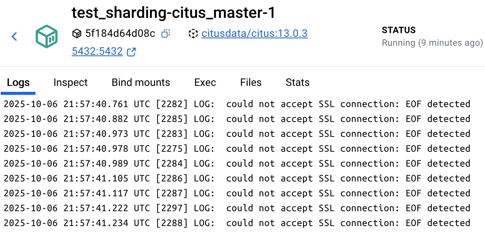

## Выводы

| Configuration            | RPS (50) | Throughput (50) | total queries | errors %   |
|--------------------------|----------|-----------------|---------------|------------|
| No Sharding              | 30       | 20/10           | 8984          | 0.02       |
| Sharding                 | 6 (-80%) | 4/2 (-80%)      | 1399 (-85%)   | 10         |
| Sharding No Partitioning | 6 (-80%) | 4/2 (-80%)      | 1184 (-87%)   | 0.6        |

- шардирование сократило производительность системы на 80%
- партицирование шардов на это никак не повлияло
- сервер стал возвращать ошибки подключения
- предполагаю, что дело в балансировщике нагрузки между кластером citus и приложением
