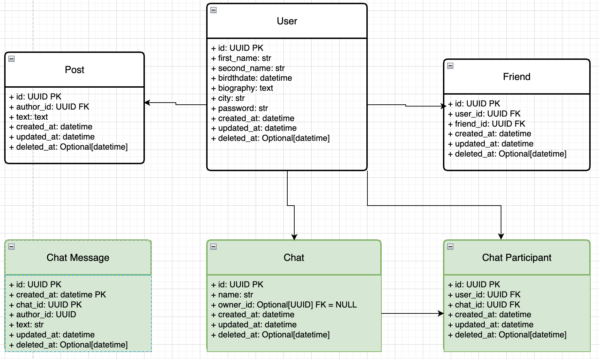

# 2025-10-05 Шардирование

## Задачи и методики

### Цель
- Обеспечить горизонтальное масштабирование хранилищ на запись с помощью шардинга.
- Предусмотреть:
  - Возможность решардинга
  - “Эффект Леди Гаги” (один пользователь пишет сильно больше среднего)
  - Наиболее эффективную схему.

### Описание данных



- Для генерации записей реализован [генератор данных](https://github.com/Grin941/social-network/blob/main/src/data_generator/generator.py)
- Таблица пользователей содержит 100_000 записей
- Каждый пользователь имеет от 20 до 1000 друзей
- С каждым другом автоматически создается чат-диалог

### Диалоги

[Код](https://github.com/Grin941/social-network/blob/main/src/social_network/domain/services/chat.py)

Когда между пользователями устанавливается дружба,
создается чат-диалог на двух пользователей.
У такого чата в отличии от группового не бывает владельца (owner_id)

Алгоритм публикации сообщения в диалог
1. пользователь отправляет сообщение и user_id друга, кому хочет отправить сообщение
2. ищем чат с участниками request_user.id и user_id
3. если чат не найден, возвращаем 400
4. сохраняем в бд ChatMessage с author_id=request_user.id и chat_id=chat.id

Алгоритм просмотра сообщений диалога
1. пользователь отправляет сообщение и user_id друга, кому хочет отправить сообщение
2. ищем чат с двумя участниками request_user.id и user_id
3. если чат не найден, возвращаем 400
4. возвращаем ChatMessage с chat_id=chat.id ORDER BY created_at DESC

### Выбор ключа шардирования

Считаем, что число чатов растет +- линейно с ростом числа пользователей (диалоги + групповые чаты, которые создаются в количестве, несопоставимо меньшем, чем число новых сообщений в чатах), поэтому не будем шардировать таблицы chats/chat_participants.
В противном случае будем терять производительность на джойнах разных шардов chats_32_shards JOIN participants_1024_shards JOIN chat_messages_111_shards.
Предположим, имеем 100_000 пользователей, у каждого по 1000 друзей – получим, что может быть
 - не больше 100_000_000 друзей
 - то есть не больше 100_000_000 чатов
 - не больше 200_000_000 строк в таблице chat_participants (пока считаем, что чаты – только диалоги)

Проверим производительность запроса на поиск чата по участникам
```sql
EXPLAIN ANALYZE
SELECT chat_id
FROM chat_participants
WHERE user_id IN ('9bef692e-50b8-4de4-8433-478b8136d880', '2940d4f8-d073-414a-8389-e9479ed3cc05')
GROUP BY chat_id
HAVING COUNT(*) = 2;
```


- Cost = 281-289
- Execution Time: 0.513 ms

Получается, что таблицы chats/chat_participants могут не шардироваться – шардируем только chat_messages.

Выбираем Shard key – составной:
 - hash(chat_id) – chat_id имеет высокую кардинальность, поэтому даст хорошее распределение ключей
 -
